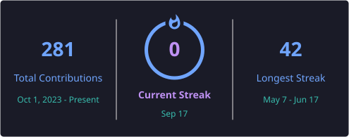

<h1 align="center">👋 Hi, I'm Rupesh Kakde</h1>  

🎓 Master of Computer Science student passionate about building scalable software and solving real-world problems. 

  

## 🚀 About Me  
- 🎓 Pursuing **Master of Computer Science (MCS)**  
- 🌐 Enjoy building dynamic websites and interactive web experiences 
- ⚡ Fun fact: I love to keep learning and exploring 🤓  
- 🏆 Goal: To grow as a **Full-Stack Developer**  

---

## 👀 Visitor Count  

  

---

## 🌐 Connect With Me  

  
  

---

## 🏆 Coding Platforms  

  
  

## 🧩 LeetCode Achievements

  

### 🥇 LeetCode Badge  

  

### 🥇 HackerRank Badge  

  

---

## 💻 Languages  

    
    
    
    

---

## ⚙️ Frameworks  

  

    

  

---

## 🎨 Frontend  

    
    
    
    

---

## 🗄 Databases  

    
    
    

---

## 🛠 Tools  

    
    
    
    

---

## 📊 GitHub Stats

  

  

---

## 🔥 GitHub Streak

  

 
## 🤹 Support  
 - 💬 Say hi on [LinkedIn](https://www.linkedin.com/in/rupeshkakde/) → guaranteed reply 🤝  

